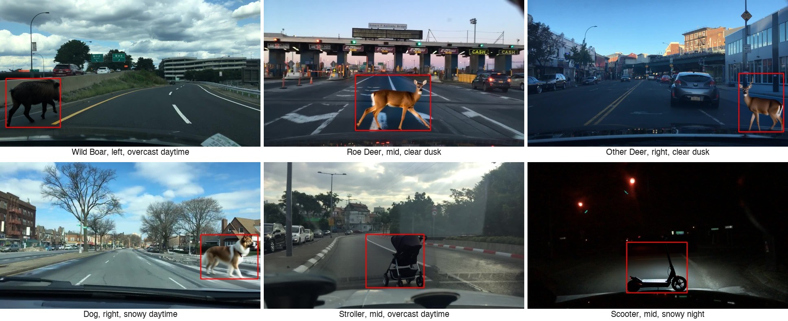

# Drive-SynOOD-OD

**A Diffusion-Inpainted Synthetic Out-of-Distribution Object Detection Benchmark for Autonomous Driving.**



*One example per OOD class, inserted into real BDD100K validation scenes by diffusion inpainting, across placement
positions, times of day, and weather. Red boxes are the quality-controlled ground truth. Every OOD image is paired
with its unmodified base image for counterfactual comparison.*

Drive-SynOOD-OD is an **evaluation-only** benchmark for **out-of-distribution (OOD) object detection** in driving
scenes. Rare road hazards (wild boar, roe deer, other deer, dog, stroller, and kick scooter) are inserted into real
BDD100K validation scenes with a diffusion inpainting pipeline, one hazard per image, and every OOD image keeps its
unmodified base image. Detectors are trained on the BDD100K training split and evaluated here.

**Paper:** to appear at the 2026 IEEE International Conference on Vehicular Electronics and Safety (ICVES).

## Dataset

The dataset is available on Hugging Face:
**[huggingface.co/datasets/CEAai/Drive-SynOOD-OD](https://huggingface.co/datasets/CEAai/Drive-SynOOD-OD)**.

## Code

The evaluation toolkit (dataloaders, detector adapters, and the evaluation protocol) will be available in this
repository soon.

## License & attribution

The dataset is **derived from [BDD100K](https://github.com/bdd100k/bdd100k)** (© 2018 Fisher Yu / Berkeley DeepDrive),
released under the **BSD 3-Clause License**. Please refer to the original
[BDD100K license terms](https://github.com/bdd100k/bdd100k/blob/master/LICENSE) for usage of the underlying images and
labels. The synthetic OOD-augmented images and the OOD annotations added in this work are provided under the **same
BSD 3-Clause terms**. When using this dataset, please **cite both BDD100K and Drive-SynOOD-OD**, and do not use the
names of the original authors or UC Berkeley to endorse or promote derived work.

## Citation

```bibtex
@inproceedings{yu2020bdd100k,
  title     = {{BDD100K}: A Diverse Driving Dataset for Heterogeneous Multitask Learning},
  author    = {Yu, Fisher and Chen, Haofeng and Wang, Xin and Xian, Wenqi and Chen, Yingying and
               Liu, Fangchen and Madhavan, Vashisht and Darrell, Trevor},
  booktitle = {IEEE/CVF Conference on Computer Vision and Pattern Recognition (CVPR)},
  year      = {2020},
}

@inproceedings{montoya2026drivesynoodod,
  title     = {{Drive-SynOOD-OD}: A Diffusion-Inpainted Synthetic Out-of-Distribution Object
               Detection Benchmark for Autonomous Driving},
  author    = {Montoya, Daniel and Espinoza Mayzer, Mauricio Sayri and Arnez, Fabio},
  booktitle = {2026 IEEE International Conference on Vehicular Electronics and Safety (ICVES)},
  address   = {Cochabamba, Bolivia},
  month     = nov,
  year      = {2026},
  publisher = {IEEE},
}
```
